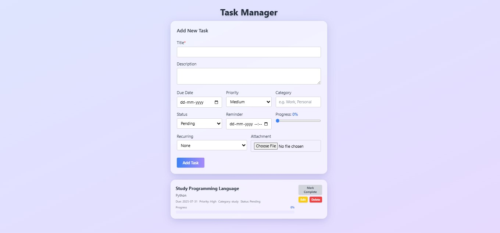

# Task Manager

A modern, responsive task management application built with React frontend and Node.js backend.

## Features

- ✨ **Modern UI/UX** - Beautiful glassmorphism design with smooth animations
- 📱 **Responsive Design** - Works perfectly on desktop, tablet, and mobile
- 🎨 **Dark/Light Mode** - Toggle between themes
- 📝 **Task Management** - Create, edit, delete, and mark tasks as complete
- 🔍 **Filter & Search** - Filter tasks by status and search functionality
- 📊 **Progress Tracking** - Visual progress indicators
- ⚡ **Real-time Updates** - Instant feedback and smooth interactions

## Tech Stack

### Frontend
- **React** - UI framework
- **Tailwind CSS** - Styling and responsive design
- **Custom CSS** - Glassmorphism effects and animations

### Backend
- **Node.js** - Runtime environment
- **Express.js** - Web framework
- **MongoDB** - Database (via Mongoose)

## Installation & Setup

### Prerequisites
- Node.js (v14 or higher)
- npm or yarn
- MongoDB (local or cloud)

### Backend Setup

1. Navigate to the backend directory:
```bash
cd backend
```

2. Install dependencies:
```bash
npm install
```

3. Start the server:
```bash
npm start
```

The backend will run on `http://localhost:5000`

### Frontend Setup

1. Navigate to the frontend directory:
```bash
cd frontend
```

2. Install dependencies:
```bash
npm install
```

3. Start the development server:
```bash
npm start
```

The frontend will run on `http://localhost:3000`

## Project Structure

```
task manager/
├── backend/
│   ├── models/
│   │   └── Task.js
│   ├── routes/
│   │   └── tasks.js
│   ├── package.json
│   └── server.js
├── frontend/
│   ├── src/
│   │   ├── components/
│   │   │   ├── FilterBar.js
│   │   │   ├── TaskForm.js
│   │   │   └── TaskList.js
│   │   ├── api.js
│   │   ├── App.js
│   │   └── index.js
│   ├── package.json
│   └── tailwind.config.js
└── README.md
```

## API Endpoints

- `GET /api/tasks` - Get all tasks
- `POST /api/tasks` - Create a new task
- `PUT /api/tasks/:id` - Update a task
- `DELETE /api/tasks/:id` - Delete a task

## Contributing

1. Fork the repository
2. Create a feature branch (`git checkout -b feature/amazing-feature`)
3. Commit your changes (`git commit -m 'Add some amazing feature'`)
4. Push to the branch (`git push origin feature/amazing-feature`)
5. Open a Pull Request

## License

This project is licensed under the MIT License.

## Screenshots

 